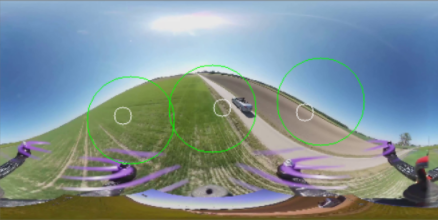

# Salient Features in VR Viewports Prediction

## Introduction

Optimizing VR videos is often a necessity as network usage exceeds the maximum bandwidth available to the device. Past researchers had made significant progress through predicting users' viewport based on previous head movements. However, we believe that the number of salient features in VR videos also play an important role in determining the areas of interest, which can aid efforts to decrease the amount of data transferred. By combining patterns observed through source videos and user's viewport data, it might be possible to further improve on the existing baseline.

## Hypothesis

Through the taxonomic classification of VR Viewport videos and the usage of machine learning algorithms on moving central objects we can significantly reduce data bandwidth with viewport prediction based on how fast user viewport rotation speeds are.

## Progress

1. **Goal:** Determine the margin of error for the correlation between the viewport data and salient feature data with Python
2. **First part**: Determine if we can use salient features / if they correlate to our viewport data
3. **Second part**: If we determine that salient features are a good representation of what people are looking at, we will determine how we can use salient features to implement viewport adaptation.

## First Part

In this video, each red circle represents a radius around a salient feature. The orange dots are user viewport centers that are included in at least one circle, and the green dots are those that are not contained in any certain. The graph on the bottom shows the correlation ratio for one specific frame.

In this picture, we can see why having a larger radius is not necessarily a good idea. Although having a larger radius increases the number of capture points (as seen in the green graph), the correlation ratio is steadily decreasing because the denominator in the ratio is the percentage of screen area captured by all the salient feature circles. Thus, four times as many captured points are needed for twice the capture radius, which means that a linear growth is not enough to increase the correlation ratio.

## Second Part

To visualize the clusters of user viewports, we performed k-means clustering on each frame and compared it against our salient features. We can think of these k-means centroids as the best possible predictions, as they are the best clustering prediction based on real user data. We can see that salient features do a better job than random prediction, but falls shorts in several frames where the gap between prefect prediction and salient feature prediction is quite large.

In this picture, green dots are user viewports, red dots are k-means centroids, and the blue dot is the salient feature. The image is left out on the top frame.

Using a [Kaggle Notebook](CorrelationProof/salient-feature-traiing.ipynb), we were able to train a model that was on average 11% off from the user viewport k-means clustering centroids. The picture above is an example of the prediction result using the model. 

The distribution of loss is skewed to the right with a median of 3755.59 and an IQR of 1735.22. 

With some more calculation, we note that for a radius of 89 (covering 60% of the screen at max), we can predict 90% of the points, which is 50% better than random prediction. 